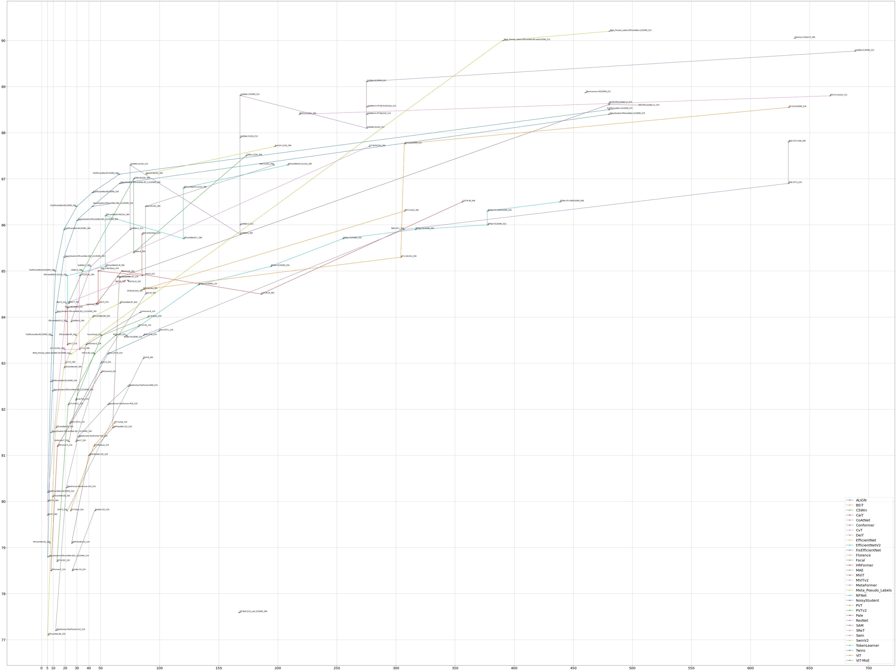

# Transformer_Backbone

## Visualization



```python
import pandas as pd
import matplotlib.pyplot as plt
data = pd.read_csv("backbone_performance.csv")

# sort_values = "FLOPs(B)"
sort_values = "Params(M)"

df = data[data[sort_values]>0]
df = df[df[sort_values]<700]
# df = data[data["TrainSet"]!="ImageNet-1K+JFT-3B"]

groups = df.groupby("Method")
fig, ax = plt.subplots(figsize=(36.0, 27.0))
ax.margins(0.05)
for name, group in groups:
    group_max_idx = group.groupby(['Model'])['Acc'].transform(max) == group['Acc']
    group_t = group[group_max_idx]
    group_t = group_t.sort_values(sort_values)
    ax.plot(group_t[sort_values], group_t["Acc"], marker='o', linestyle='-', ms=5, label=name)
    for k, v in group_t.iterrows():
        ax.annotate(v['Model']+"_"+str(v['Size']), [v[sort_values], v['Acc']],
                    xytext=(-10,5), textcoords='offset points',
                    family='sans-serif', fontsize=15, color='darkslategrey')

fig.tight_layout()
plt.legend(fontsize=20,loc='lower right')
plt.tick_params(labelsize=20)
plt.show()
```

## Paper

- CoAtNet
  - CoAtNet: Marrying Convolution and Attention for All Data Sizes
  - [papers_with_code](https://paperswithcode.com/paper/coatnet-marrying-convolution-and-attention)
- ViT-G/14
  - Scaling Vision Transformers
  - [paper](https://arxiv.org/abs/2106.04560v1)
- SwinV2
  - Swin Transformer V2: Scaling Up Capacity and Resolution
  - [papers_with_code](https://paperswithcode.com/paper/swin-transformer-v2-scaling-up-capacity-and)
- ViT-MoE
  - Scaling Vision with Sparse Mixture of Experts
  - [paper](https://paperswithcode.com/paper/scaling-vision-with-sparse-mixture-of-experts)
- Florence
  - Florence: A New Foundation Model for Computer Vision
  - [paper](https://arxiv.org/abs/2111.11432v1)
- ALIGN
  - Scaling Up Visual and Vision-Language Representation Learning With Noisy Text Supervision
  - [papers_with_code](https://paperswithcode.com/paper/scaling-up-visual-and-vision-language)
- MViTv2
  - Improved Multiscale Vision Transformers for Classification and Detection
  - [paper](https://arxiv.org/abs/2112.01526v1)
- MViT
  - Multiscale Vision Transformers
  - [papers_with_code](https://paperswithcode.com/paper/multiscale-vision-transformers)
- BEiT
  - BEiT: BERT Pre-Training of Image Transformers
  - [papers_with_code](https://paperswithcode.com/paper/beit-bert-pre-training-of-image-transformers)
- Meta_Pseudo_Labels
  - Meta Pseudo Labels
  - [papers_with_code](https://paperswithcode.com/paper/meta-pseudo-labels)
- SAM
  - Sharpness-Aware Minimization for Efficiently Improving Generalization
  - [papers_with_code](https://paperswithcode.com/paper/sharpness-aware-minimization-for-efficiently-1)
- NFNet
  - High-Performance Large-Scale Image Recognition Without Normalization
  - [papers_with_code](https://paperswithcode.com/paper/high-performance-large-scale-image)
- TokenLearner
  - TokenLearner: What Can 8 Learned Tokens Do for Images and Videos?
  - [papers_with_code](https://paperswithcode.com/paper/tokenlearner-what-can-8-learned-tokens-do-for)
- BiT
  - Big Transfer (BiT): General Visual Representation Learning
  - [papers_with_code](https://paperswithcode.com/paper/large-scale-learning-of-general-visual)
- Focal
  - Focal Attention for Long-Range Interactions in Vision Transformers
  - [paper & code](https://papers.nips.cc/paper/2021/hash/fc1a36821b02abbd2503fd949bfc9131-Abstract.html)
- MetaFormer
  - MetaFormer is Actually What You Need for Vision
  - [papers_with_code](https://paperswithcode.com/paper/metaformer-is-actually-what-you-need-for)
- CSWin
  - CSWin Transformer: A General Vision Transformer Backbone with Cross-Shaped Windows
  - [papers_with_code](https://paperswithcode.com/paper/cswin-transformer-a-general-vision)
- Twins
  - Twins: Revisiting the Design of Spatial Attention in Vision Transformers
  - [papers_with_code](https://paperswithcode.com/paper/twins-revisiting-spatial-attention-design-in)
- Swin
  - Swin Transformer: Hierarchical Vision Transformer using Shifted Windows
  - [papers_with_code](https://paperswithcode.com/paper/swin-transformer-hierarchical-vision)
- CaiT
  - Going deeper with Image Transformers
  - [papers_with_code](https://paperswithcode.com/paper/going-deeper-with-image-transformers)
- CvT
  - CvT: Introducing Convolutions to Vision Transformers
  - [papers_with_code](https://paperswithcode.com/paper/cvt-introducing-convolutions-to-vision)
- PvTv2
  - PVTv2: Improved Baselines with Pyramid Vision Transformer
  - [papers_with_code](https://paperswithcode.com/paper/pvtv2-improved-baselines-with-pyramid-vision)
- PvT
  - Pyramid Vision Transformer: A Versatile Backbone for Dense Prediction without Convolutions
  - [paper](https://arxiv.org/abs/2102.12122), [code](https://github.com/whai362/PVT)
- SReT
  - Sliced Recursive Transformer
  - [papers_with_code](https://paperswithcode.com/paper/sliced-recursive-transformer-1)
- ViT
  - An Image is Worth 16x16 Words: Transformers for Image Recognition at Scale
  - [papers_with_code](https://paperswithcode.com/paper/an-image-is-worth-16x16-words-transformers-1)
- EfficientNet
  - EfficientNet: Rethinking Model Scaling for Convolutional Neural Networks
  - [papers_with_code](https://paperswithcode.com/method/efficientnet)
- 