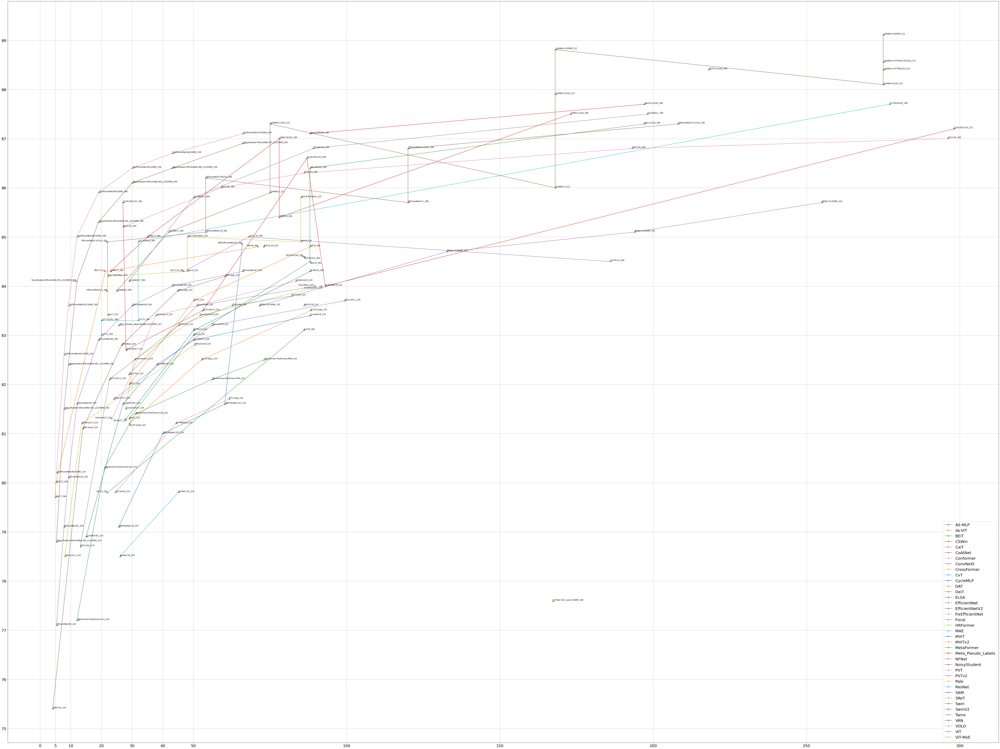

# Transformer_Backbone

## Visualization

Requirements

- [adjustText](https://github.com/Phlya/adjustText)

Example

- [show.ipynb](show.ipynb)

## Paper

- CoAtNet
  - CoAtNet: Marrying Convolution and Attention for All Data Sizes
  - [papers_with_code](https://paperswithcode.com/paper/coatnet-marrying-convolution-and-attention)
- ViT-G/14
  - Scaling Vision Transformers
  - [paper](https://arxiv.org/abs/2106.04560v1)
- SwinV2
  - Swin Transformer V2: Scaling Up Capacity and Resolution
  - [papers_with_code](https://paperswithcode.com/paper/swin-transformer-v2-scaling-up-capacity-and)
- ViT-MoE
  - Scaling Vision with Sparse Mixture of Experts
  - [paper](https://paperswithcode.com/paper/scaling-vision-with-sparse-mixture-of-experts)
- Florence
  - Florence: A New Foundation Model for Computer Vision
  - [paper](https://arxiv.org/abs/2111.11432v1)
- ALIGN
  - Scaling Up Visual and Vision-Language Representation Learning With Noisy Text Supervision
  - [papers_with_code](https://paperswithcode.com/paper/scaling-up-visual-and-vision-language)
- MViTv2
  - Improved Multiscale Vision Transformers for Classification and Detection
  - [paper](https://arxiv.org/abs/2112.01526v1)
- MViT
  - Multiscale Vision Transformers
  - [papers_with_code](https://paperswithcode.com/paper/multiscale-vision-transformers)
- BEiT
  - BEiT: BERT Pre-Training of Image Transformers
  - [papers_with_code](https://paperswithcode.com/paper/beit-bert-pre-training-of-image-transformers)
- Meta_Pseudo_Labels
  - Meta Pseudo Labels
  - [papers_with_code](https://paperswithcode.com/paper/meta-pseudo-labels)
- SAM
  - Sharpness-Aware Minimization for Efficiently Improving Generalization
  - [papers_with_code](https://paperswithcode.com/paper/sharpness-aware-minimization-for-efficiently-1)
- NoisyStudent
  - Self-training with Noisy Student improves ImageNet classification
  - [papers_with_code](https://paperswithcode.com/paper/self-training-with-noisy-student-improves)
- NFNet
  - High-Performance Large-Scale Image Recognition Without Normalization
  - [papers_with_code](https://paperswithcode.com/paper/high-performance-large-scale-image)
- TokenLearner
  - TokenLearner: What Can 8 Learned Tokens Do for Images and Videos?
  - [papers_with_code](https://paperswithcode.com/paper/tokenlearner-what-can-8-learned-tokens-do-for)
- BiT
  - Big Transfer (BiT): General Visual Representation Learning
  - [papers_with_code](https://paperswithcode.com/paper/large-scale-learning-of-general-visual)
- MAE
  - Masked Autoencoders Are Scalable Vision Learners
  - [papers_with_code](https://paperswithcode.com/paper/masked-autoencoders-are-scalable-vision)
- Focal
  - Focal Attention for Long-Range Interactions in Vision Transformers
  - [paper & code](https://papers.nips.cc/paper/2021/hash/fc1a36821b02abbd2503fd949bfc9131-Abstract.html)
- MetaFormer
  - MetaFormer is Actually What You Need for Vision
  - [papers_with_code](https://paperswithcode.com/paper/metaformer-is-actually-what-you-need-for)
- CSWin
  - CSWin Transformer: A General Vision Transformer Backbone with Cross-Shaped Windows
  - [papers_with_code](https://paperswithcode.com/paper/cswin-transformer-a-general-vision)
- Twins
  - Twins: Revisiting the Design of Spatial Attention in Vision Transformers
  - [papers_with_code](https://paperswithcode.com/paper/twins-revisiting-spatial-attention-design-in)
- Swin
  - Swin Transformer: Hierarchical Vision Transformer using Shifted Windows
  - [papers_with_code](https://paperswithcode.com/paper/swin-transformer-hierarchical-vision)
- CaiT
  - Going deeper with Image Transformers
  - [papers_with_code](https://paperswithcode.com/paper/going-deeper-with-image-transformers)
- CvT
  - CvT: Introducing Convolutions to Vision Transformers
  - [papers_with_code](https://paperswithcode.com/paper/cvt-introducing-convolutions-to-vision)
- PvTv2
  - PVTv2: Improved Baselines with Pyramid Vision Transformer
  - [papers_with_code](https://paperswithcode.com/paper/pvtv2-improved-baselines-with-pyramid-vision)
- PvT
  - Pyramid Vision Transformer: A Versatile Backbone for Dense Prediction without Convolutions
  - [paper](https://arxiv.org/abs/2102.12122), [code](https://github.com/whai362/PVT)
- SReT
  - Sliced Recursive Transformer
  - [papers_with_code](https://paperswithcode.com/paper/sliced-recursive-transformer-1)
- ViT
  - An Image is Worth 16x16 Words: Transformers for Image Recognition at Scale
  - [papers_with_code](https://paperswithcode.com/paper/an-image-is-worth-16x16-words-transformers-1)
- HRFormer
  - HRFormer: High-Resolution Vision Transformer for Dense Predict
  - [paper & code](https://papers.nips.cc/paper/2021/hash/3bbfdde8842a5c44a0323518eec97cbe-Abstract.html)
- Conformer
  - Conformer: Local Features Coupling Global Representations for Visual Recognition
  - [papers_with_code](https://paperswithcode.com/paper/conformer-local-features-coupling-global)
- FixEfficientNet
  - Fixing the train-test resolution discrepancy: FixEfficientNet
  - [papers_with_code](https://paperswithcode.com/paper/fixing-the-train-test-resolution-discrepancy-2)
- EfficientNetV2
  - EfficientNetV2: Smaller Models and Faster Training
  - [papers_with_code](https://paperswithcode.com/paper/efficientnetv2-smaller-models-and-faster)
- EfficientNet
  - EfficientNet: Rethinking Model Scaling for Convolutional Neural Networks
  - [papers_with_code](https://paperswithcode.com/method/efficientnet)
- Pale
  - Pale Transformer: A General Vision Transformer Backbone with Pale-Shaped Attention
  - [paper](https://arxiv.org/abs/2112.14000)
- VOLO
  - VOLO: Vision Outlooker for Visual Recognition
  - [papers_with_code](https://paperswithcode.com/paper/volo-vision-outlooker-for-visual-recognition)
- ELSA
  - ELSA: Enhanced Local Self-Attention for Vision Transformer
  - [papers_with_code](https://paperswithcode.com/paper/elsa-enhanced-local-self-attention-for-vision)
- 